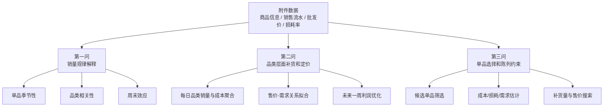

# 2023 全国大学生数学建模竞赛 C 题

本目录是 2023 年全国大学生数学建模竞赛 C 题的代码整理。题目背景是生鲜商超蔬菜类商品经营：在历史销售流水、商品分类、批发价格和损耗率数据基础上，分析销售规律，并给出补货与定价策略。

这组代码更接近一次数学建模训练的过程记录，而不是一个已经抽象好的业务系统。脚本按题目拆分，核心价值在于展示从原始附件到统计分析、需求建模、利润函数和优化策略的完整思路。

## 问题拆解



## 数据与预处理

代码默认使用赛题附件：

- 附件 1：单品编码、单品名称和分类名称。
- 附件 2：销售日期、扫码时间、销量、销售单价、销售类型等流水数据。
- 附件 3：单品每日批发价格。
- 附件 4：单品损耗率。

预处理重点包括：

- 统一 `单品编码` 为字符串，避免 Excel 数字编码在 merge 时类型不一致。
- 合并销售日期和扫码时间，生成可按日、周末、季度聚合的时间字段。
- 过滤退货或非正常销售记录，尽量让销量统计只反映实际销售。
- 将损耗率从百分数转为小数，并在缺失时使用品类均值兜底。

## 核心方法

### 第一问：解释销售规律

第一问拆成三个脚本，分别回答“什么时候卖得多”“哪些品类走势相关”“周末是否改变销售节奏”。

- 单品季节性：按自定义季度聚合销量，使用变异系数 `CV = std / mean` 区分强季节性和弱季节性单品。
- 大类关联性：按品类和季度聚合销量，计算品类间相关系数矩阵并绘制热力图。
- 周末效应：将销售日期标记为工作日/周末，在品类和单品两个层面比较销量差异，并用 CV 判断影响强弱。

这些分析偏解释性，作用是为后续补货与定价提供直觉和约束依据，而不是直接预测未来销量。

### 第二问：品类补货与定价

第二问从品类层面构造每日数据：

- 销售总量：按 `分类名称 + 销售日期` 聚合。
- 日均价：按品类日销售单价取平均。
- 日成本：按品类日批发价取平均。
- 成本加成率：`(售价 - 成本) / 成本`。
- 损耗率：由附件 4 聚合到品类层面。

需求关系上，脚本尝试线性模型和 Logistic 饱和模型，用拟合优度选择更合适的形式。优化目标围绕利润构造：销售收入减去进货成本和损耗影响，在未来 2023-07-01 到 2023-07-07 的时间窗内给出补货量与定价建议。

### 第三问：单品选择与组合优化

第三问下沉到单品层面。代码先筛选 2023-06-24 到 2023-06-30 有销售记录的候选单品，再估计：

- 单品预测成本：候选周期内批发价均值，缺失时用品类均值。
- 单品损耗率：附件 4 给定值，缺失时用品类均值。
- 品类需求基准：候选周期各品类日均销量。
- 单品需求模型：用售价和销量拟合线性或 Logistic 关系，样本不足时退化到品类模型或默认模型。

第三问目标是同时考虑可售单品、最小陈列量、需求满足和利润最大化。当前脚本属于启发式组合优化尝试，重点在流程完整性和约束落地，尚未封装成稳定求解器。

## 文件导览

| 文件 | 作用 | 阅读重点 |
| --- | --- | --- |
| `23国赛C-第一问(单品季节性分析）.py` | 单品季度销量趋势和季节性强弱分析。 | 季度定义、CV 阈值、单品到品类映射。 |
| `23国赛C-第一问（大类关联性分析）.py` | 品类季度销量相关性热力图。 | 聚合粒度和相关矩阵解释。 |
| `23国赛C-第一问（周末分析）.py` | 工作日/周末销量对比。 | 周末特征构造和品类/单品两层统计。 |
| `23国赛C-第二问.py` | 品类需求关系拟合、未来一周补货定价。 | 成本加成率、损耗率、线性/Logistic 模型选择和利润目标。 |
| `23国赛C-第三问.py` | 单品候选筛选、成本损耗估计、单品需求模型和组合优化。 | 数据兜底策略、陈列约束、利润函数。 |

## 运行说明

当前脚本保留了当时本机路径，例如：

```python
BASE_PATH = r"C:\Users\21165\Desktop\23数模C题"
```

复现前需要将这些路径改为自己的附件目录，并确认附件列名与脚本中的 `usecols` 一致。

常用依赖：

```bash
pip install pandas numpy matplotlib seaborn scikit-learn scipy openpyxl
```

## 局限与复盘

- 路径、输出图名和部分参数仍写死在脚本中，不利于跨机器复现。
- 第一问的统计分析可以解释规律，但没有显著性检验或更严格的时间序列建模。
- 第二问和第三问中，需求函数受样本质量影响较大，线性/Logistic 的选择仍偏经验。
- 第三问优化逻辑可继续改成更明确的混合整数规划或约束优化模型。

这次项目最重要的收获是：竞赛代码不能只追求“跑出答案”，还要让每个变量和约束能回到题意中解释。后续如果继续整理，我会优先把数据路径参数化，并把第二、三问的目标函数和约束写成更清晰的数学形式。
