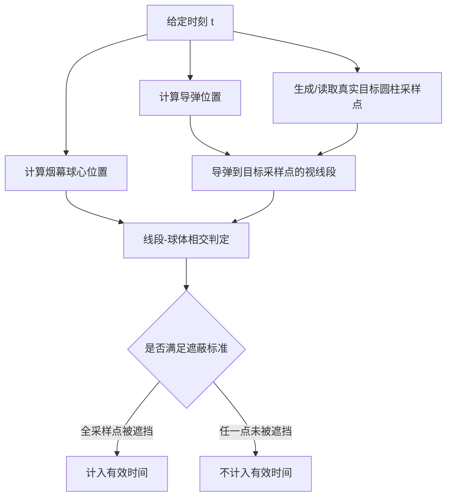

# 2025 全国大学生数学建模竞赛 A 题

本目录收录 2025 年国赛 A 题的建模与代码实现。项目主题是无人机投放烟幕干扰弹后，对来袭导弹形成有效遮蔽的时间计算与策略优化。

我在这个题目中的主要工作集中在程序实现和数值验证：把题目中的物理过程写成三维几何模型，把“有效遮蔽”转化成线段与球体相交判定，再通过粒子群、遗传算法、粗筛加精修等方法搜索更优投放方案。

## 建模对象

题目中的主要对象可以抽象为四类：

| 对象 | 建模方式 |
| --- | --- |
| 导弹 | 从初始位置以 300 m/s 匀速飞向假目标原点。 |
| 无人机 | 在固定高度近似匀速直线飞行，速度和方向受约束。 |
| 烟幕弹 | 从无人机投放后做平抛运动，到起爆时形成烟幕云团。 |
| 烟幕云团 | 起爆后半径 10 m，有效 20 s，并以 3 m/s 下沉。 |
| 真实目标 | 半径 7 m、高 10 m 的圆柱体，下底面圆心为 `(0, 200, 0)`。 |

## 核心判定逻辑

代码的关键不是单纯计算烟幕中心到导弹的距离，而是判断导弹视线是否被烟幕球体挡住。



这里有一个重要建模选择：真实目标不能只用中心点代表。脚本中把圆柱体按高度层和圆周角离散成采样点，只有采样点满足脚本设定的遮蔽逻辑时，才累计有效遮蔽时间。早期只看中心点会得到偏乐观结果，后续代码改为圆柱采样后更保守、更符合题意。

## 优化路线

不同问题的变量规模逐步增大：

- 问题一：参数固定，只计算某一方案的有效遮蔽时间。
- 问题二：优化单架无人机一枚烟幕弹的方向、速度、投放时间和起爆延迟。
- 问题三：扩展到同一无人机多枚烟幕弹，需要考虑投放时间间隔和遮蔽时间并集。
- 问题四、五：进一步扩展到多无人机、多烟幕弹或多导弹协同，变量维度和计算量显著增加。

为控制计算量，代码中使用了几类加速和验证策略：

- 预生成圆柱采样点，避免在适应度函数里重复采样。
- 预生成导弹轨迹或用 Numba 加速核心循环。
- 使用粒子群优化 PSO、遗传算法 GA、粗筛加精修和局部验证。
- 用更小时间步长重新验证候选极值方案，减少优化阶段离散误差导致的误判。

## 文件导览

| 文件 | 作用 | 备注 |
| --- | --- | --- |
| `25A第一问（1）.py` | 第一问固定参数遮蔽时间计算。 | 明确采用“所有采样点全遮挡才有效”的保守逻辑。 |
| `25A第一问（2）.py`、`25A第一问（3）.py` | 第一问其他版本。 | 保留为迭代痕迹。 |
| `25A第二问（deep+kimi）.py`、`25A第二问（豆包）.py` | 第二问单弹参数搜索。 | PSO 搜索方向、速度、投放时刻、起爆延迟。 |
| `25A第二问极值验证选择（kimi）.py`、`25A第二问极值验证选择（豆包）.py` | 第二问候选解验证。 | 用更严格步长和独立函数复核候选方案。 |
| `25A第三问（kimi+deep）.py`、`25A第三问（豆包）.py` | 第三问多烟幕弹优化。 | 包含并集遮蔽时间、约束修正和解析/离散校验。 |
| `25A第四问（kimi2）.py`、`25A第四问（kimi+deep）.py`、`25A第四问（deep）.py`、`25A第四问（豆包）.py` | 第四问多无人机协同相关尝试。 | 多版脚本用于对比方案、读表验证或 PSO 搜索。 |
| `25A第四问F1验证.py` | 特定方案验证。 | 用于复核某个无人机/烟幕配置的有效性。 |
| `25国赛A第五问（deep）.py`、`25国赛A第五问（kimi）.py`、`25国赛A第五问（豆包）.py` | 第五问复杂协同优化尝试。 | 包含 GA、PSO、VNS 或粗筛精修等不同策略。 |
| `best_solution.txt` | 某次优化得到的候选参数向量。 | 仅保存数值，不含字段名，需要结合对应脚本解释。 |
| `25A第四问.py`、`25A第五问.py` | 空文件。 | 当前没有有效代码，保留为占位或历史遗留。 |

## 运行说明

常用依赖：

```bash
pip install numpy scipy matplotlib pandas openpyxl numba
```

部分脚本有 Numba 自动加速逻辑；如果未安装 Numba，部分版本可能退化为 Python 循环或直接无法运行，具体以脚本实现为准。

建议阅读顺序：

1. 先读 `25A第一问（1）.py`，理解物理常量、圆柱采样、烟幕中心和线段-球体相交。
2. 再读 `25A第二问（deep+kimi）.py`，看单弹优化变量如何编码。
3. 最后看第三、四、五问脚本，关注变量维度增加后如何做并行评估和候选解验证。

## 结果可信度与局限

- 时间积分依赖 `DT_CHECK`，步长越小越准但计算量越高。
- 圆柱采样密度影响遮蔽判定，采样过少可能高估有效时长。
- 多版脚本中存在“全遮蔽”和“部分遮蔽”两种口径，阅读时必须先看文件顶部注释和判定函数。
- 多人协作后留下了若干以工具来源或验证目的命名的脚本，版本关系还不够干净。
- `best_solution.txt` 缺少列名，后续需要整理成带字段名的 CSV 或 Markdown 表格。

这个项目对我最有价值的一点是：几何建模的细节会直接决定结果可信度。只有把“导弹看到真实目标的哪一部分被挡住”这个问题写成可检查的几何判定，后续优化出来的时间才有意义。
