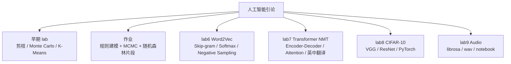

# 人工智能引论课程实验

本目录整理 2025 秋季《人工智能引论》课程中的实验、作业和模型实现。内容覆盖传统机器学习基础实验、Word2Vec、Transformer 机器翻译、CIFAR-10 图像分类和音频处理。

这个目录不是一个统一工程，而是一组课程主题项目。阅读时建议按实验主题进入子目录，而不是试图在根目录寻找统一入口。

## 课程内容地图



## 子目录说明

| 目录 | 内容 | 当前状态 |
| --- | --- | --- |
| `早期lab/` | 剪枝、蒙特卡洛估计圆周率、K-Means 聚类。 | 基础算法练习脚本。 |
| `作业/我的解答/` | 一个包含 MCMC 反推、随机森林预测和结果可视化的建模脚本。 | 依赖外部数据路径。 |
| `lab6_w2v/` | Word2Vec 实验，核心代码在 `lab6_w2v/w2v/`。 | 有环境文件、数据集和训练产物。 |
| `lab7/transformer-nmt-pub/` | Transformer 英中机器翻译实验。 | 有代码、数据、权重和原始 README。 |
| `lab8/` | CIFAR-10 图像分类实验。 | 有训练脚本、数据和 VGG/ResNet 权重。 |
| `lab9/` | 音频处理实验。 | 有 notebook、PDF 和两个 wav 示例。 |

## 重点实验

### Lab 6：Word2Vec

`lab6_w2v/w2v/word2vec.py` 是这个实验的核心。它没有直接调用现成 Word2Vec 库，而是手写关键计算：

- 数值稳定版 `sigmoid`。
- naive softmax loss and gradient。
- negative sampling loss and gradient。
- Skip-gram 模型。
- dummy dataset 上的梯度检查。
- Stanford Sentiment Treebank 上的训练入口。

配套文件包括 `sgd.py`、`run.py`、`utils/gradcheck.py`、`utils/treebank.py` 和训练保存的 `saved_params_*.npy`、`saved_state_*.pickle`。这个实验的价值在于把词向量训练从“公式”落到梯度实现。

### Lab 7：Transformer NMT

`lab7/transformer-nmt-pub/` 实现了一个英中翻译项目。`transformer_model.py` 中包含 Transformer 的主要结构：

- Embedding 和 sinusoidal positional encoding。
- scaled dot-product attention。
- multi-head attention。
- residual connection + layer normalization。
- encoder layer / decoder layer。
- generator、mask、label smoothing 等训练辅助模块。

`transformer_nmt.py` 负责训练和数据流程。`nmt/en-cn/` 下保存英中句对，包括完整数据和 mini 数据。`save/model.pt` 是保存的 PyTorch 模型权重。

### Lab 8：CIFAR-10 图像分类

`lab8/main.py` 使用 PyTorch 完成 CIFAR-10 分类实验。脚本包含：

- `load_data`：通过 `torchvision.datasets.CIFAR10` 加载或下载数据。
- `BaselineNet`：基础卷积网络。
- `MyVGG`：缩小版 VGG 风格网络，使用卷积、BatchNorm、ReLU、Pooling 和 Dropout。
- `MyResNet`：手写残差块和 shortcut 分支的轻量 ResNet。
- 训练循环：SGD、交叉熵、4 epoch 训练。
- 测试函数：输出整体准确率和每类准确率。
- 权重保存：`cifar_Modified_VGG.pth`、`cifar_Modified_ResNet.pth`。

### Lab 9：音频处理

`lab9` 包含 `lab9.ipynb`、`lab9.pdf`、`piano_c.wav` 和 `scale.wav`。原始说明提到实验目标是理解语音文件处理和常见特征提取，学习 `librosa` 的基本使用。

## 运行建议

不同实验环境差异较大，建议分目录运行：

```bash
# Word2Vec
cd 25秋人工智能引论/lab6_w2v/w2v
python run.py

# Transformer NMT
cd 25秋人工智能引论/lab7/transformer-nmt-pub
python transformer_nmt.py

# CIFAR-10
cd 25秋人工智能引论/lab8
python main.py
```

依赖大致包括：

```bash
pip install numpy pandas matplotlib scikit-learn torch torchvision jupyter librosa
```

`lab6_w2v/w2v/env.yml` 和 `lab7/transformer-nmt-pub/requirements.txt` 里保留了部分实验环境信息。深度学习实验建议单独建环境，避免版本冲突。

## 阅读重点与局限

- 这个目录最值得看的不是模型效果，而是核心结构是否真的手写并理解。
- Word2Vec 和 Transformer 代码更接近课程实验，注释较多，但工程封装不强。
- CIFAR-10 训练 epoch 较少，目标是跑通模型结构和训练流程，不是追求 SOTA 准确率。
- 部分作业脚本依赖本地数据路径，不能直接复现。
- `lab7` 的原始 README 很短，本目录 README 对其结构做了额外解释。

这组实验反映的是 AI 基础学习阶段的能力路径：先能复现基础算法，再能手写模型结构，最后能理解训练、评估和数据处理之间的关系。
