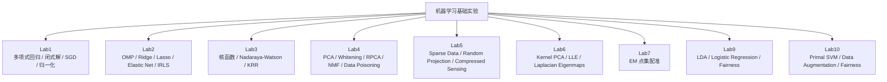

# 2026 春机器学习基础

本目录保存 2026 春季机器学习基础课程实验。整体风格是“尽量手写核心算法 + 用图像结果验证理解”：从多项式回归、稀疏回归、核方法，到 PCA/RPCA、压缩感知、流形学习、点集配准，再到 Adult 数据集上的 LDA、Logistic Regression、SVM 和公平性检查。

这些实验不是为了调用成熟库得到最高指标，而是训练对模型目标函数、优化方法、矩阵分解和数据表示的理解。很多脚本明确限制依赖，例如只允许 `numpy`、`matplotlib` 或少量指定库。

## 实验地图



## 子目录导览

| 目录 | 主题 | 主要产物 |
| --- | --- | --- |
| `lab1/` | 多项式回归、闭式解、SGD、归一化。 | `Order3.png`、`Order5.png`、`Order7.png`、`Order9.png` |
| `lab2/` | 稀疏线性模型：OMP、Ridge、Lasso、Elastic Net、IRLS。 | 控制台 MSE 对比 |
| `lab3/` | 核回归：核函数、Nadaraya-Watson、Kernel Ridge Regression、SGD/BCD 训练。 | `result_*.png` |
| `lab4/` | PCA、数据白化、Robust PCA、协方差投毒、NMF。 | PCA/RPCA/whitening/poisoning 图 |
| `lab5/` | 稀疏数据生成、随机投影、压缩感知恢复、协方差可视化。 | `data_cov.png`、`est_data_cov_*.png`、`cs_data_cov_*.png` |
| `lab6/` | 流形学习和非线性降维：Kernel PCA、LLE、Laplacian Eigenmaps。 | KPCA/LLE/LE 降维图 |
| `lab7/` | 基于 EM 的点集仿射配准。 | `fish.mat`、`result.png`、`correspondence.png` |
| `lab9+10/Lab9/` | Adult 数据集上的 LDA 与 Logistic Regression，并检查性别公平性差异。 | `adult.csv`、`Lab9.pdf` |
| `lab9+10/Lab10/` | Primal SVM 和数据增强抑制不公平。 | `adult.csv`、`Lab10.pdf` |

## 方法线索

这组实验可以按三个层次理解：

1. 线性模型与稀疏性：`lab1`、`lab2` 从最小二乘出发，逐步加入正则化、稀疏约束和鲁棒损失。
2. 表示与降维：`lab3` 到 `lab6` 关注核技巧、主成分、压缩感知和流形结构，重点是如何在不同空间中表示数据。
3. 真实数据和公平性：`lab9+10` 使用 Adult 数据集，把分类准确率和性别群体间预测比例差异放在一起检查。

## 运行方式

进入具体 lab 目录运行脚本即可，例如：

```bash
cd 26春机器学习基础/lab6
python script_lab6.py
```

常用依赖：

```bash
pip install numpy matplotlib scipy pandas
```

部分实验会在当前目录生成或覆盖 `.png` 结果图。`lab7` 需要同目录 `fish.mat`；`Lab9` 和 `Lab10` 需要同目录 `adult.csv`。

## 局限

- 多数脚本是课程模板基础上的实验实现，保留了 `TODO` 注释和课堂任务结构。
- 实验重在算法理解，参数没有做系统调优。
- 结果图是某次运行产物，若随机种子或参数改变，图像可能不同。
- `Lab9`、`Lab10` 的公平性检查使用的是简单群体统计，不等同于完整公平机器学习评估。

阅读重点应放在每个算法的目标函数、矩阵计算和优化更新是否清楚，而不是单次实验指标。
