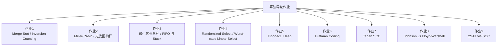

# 2026 春算法导论

本目录保存 2026 春季算法导论课程作业代码。内容覆盖分治、随机化、堆、选择算法、斐波那契堆、Huffman 编码、强连通分量、全源最短路和 2SAT。

这些脚本大多是可独立运行的作业演示，重点是把课堂算法写成清楚的 Python 实现，并用小规模输入或随机数据验证行为。

## 作业地图



## 文件导览

| 目录 | 主题 | 核心文件 |
| --- | --- | --- |
| `作业1/` | 分治排序与逆序对计数。 | `Merge_Sort.py`、`Inversion_Counting.py` |
| `作业2/` | Miller-Rabin 素数检验、合数分解、Fisher-Yates 风格无放回抽样。 | `Miller-Rabin 素数检验.py`、`无放回抽样（Sample Without Replacement）.py` |
| `作业3/` | 最小优先队列，以及用优先队列模拟 FIFO 队列和栈。 | `最小优先队列的实现.py`、`优先队列先进先出.py` |
| `作业4/` | 期望线性时间选择与最坏情况线性时间选择。 | `代码.py`、`测评.py` |
| `作业5/` | 斐波那契堆插入、extract-min 和结构打印。 | `斐波那契堆.py` |
| `作业6/` | Huffman 编码树构造和编码长度统计。 | `霍夫霍夫曼编码.py` |
| `作业7/` | Tarjan 一次 DFS 求强连通分量。 | `一次DFS实现SCC.py` |
| `作业8/` | Johnson 与 Floyd-Warshall 全源最短路比较。 | `johnson算法和floyd-warshall算法比较.py` |
| `作业9/` | 使用 SCC 判定 2SAT 可满足性并构造赋值。 | `2SAT的scc算法.py` |

## 运行方式

进入对应作业目录运行脚本：

```bash
cd 26春算法导论/作业8
python johnson算法和floyd-warshall算法比较.py
```

大多数脚本只依赖 Python 标准库；`作业8` 使用 `typing` 但不需要额外安装包。

## 阅读重点

- `作业1` 和 `作业4` 适合看分治算法如何同时完成计算和递归合并。
- `作业3`、`作业5` 适合看堆结构的维护逻辑。
- `作业7`、`作业9` 适合看 DFS 编号、low-link 和 SCC 在图问题中的复用。
- `作业8` 适合比较稠密图和稀疏图下两类全源最短路算法的实际运行差异。

## 局限

- 代码以课程演示为主，没有统一测试框架。
- 一些脚本使用交互输入或随机数据，运行结果可能随输入或随机种子变化。
- 部分实现重在可读性，没有追求极限性能或完整异常处理。

这个目录展示的是经典算法的手写能力和复杂度意识，适合作为算法课作业归档和复习材料。
