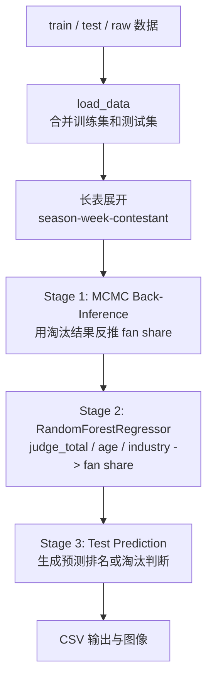

# 2026 美赛 C 题片段

本目录保存 2026 年美赛 C 题相关的阶段性代码和图像结果。目前它不是完整项目，而是一个建模片段归档：核心脚本 `01.py` 围绕“从淘汰结果反推潜在投票份额，再预测测试集”的三阶段流程展开。

由于缺少完整题面、数据附件和论文，这里的说明只基于当前代码和文件做解释，不把它包装成完整可复现项目。

## 当前文件

| 文件 | 说明 |
| --- | --- |
| `01.py` | 主脚本，定义 `DWTSSolver`，包含数据读取、长表展开、MCMC 反推、随机森林预测、结果生成和可视化。 |
| `append_vs_insert.png` | 阶段性分析图，具体生成逻辑未在当前脚本中直接体现。 |
| `q2_4_plots.png` | 问题 2/4 相关结果图，属于已有图像产物。 |

## 建模流程

`01.py` 的核心类是 `DWTSSolver`。从函数名和变量名看，问题数据包含 season、week、contestant、judge score、age、industry、elimination 等字段。代码意图是从训练集中已知淘汰结果反推不可观测的 fan share，再把 fan share 作为监督信号预测测试集。



## 关键方法

### 规则分段

`get_season_rule(season)` 根据赛季切换规则：

- `S1-S2`：使用 rank 规则。
- `S3-S27`：使用 percent 规则。
- `S28-S34`：使用 rank + judges' save 规则。

这说明代码不是简单回归，而是先把赛制变化编码进似然函数。

### MCMC 反推

训练集中 fan vote 不直接可见，脚本用 MCMC 在每个 `season-week` 分组内采样潜在投票份额 `p_vec`。能量函数 `calculate_energy` 本质上是负对数似然：

- 如果是 percent 规则，淘汰概率由评委分数份额和粉丝份额的总和决定。
- 如果是 rank 规则，先把评委分数和粉丝份额转为排名，再用排名和决定淘汰概率。
- 如果是 rank + save 规则，进一步加入 bottom 2 和评委 save 的近似概率。

采样后得到的 `mcmc_fan_share` 被当作后续监督学习的目标。

### 随机森林预测

脚本使用 `RandomForestRegressor(n_estimators=200, max_depth=10, random_state=42, n_jobs=-1)`，输入特征包括：

- `judge_total`
- `age`
- `industry` 的 one-hot 编码

模型训练在训练集上完成，然后对测试集预测 `predicted_fan_share`。后续再结合每周分组规则生成结果。

## 运行说明

脚本底部路径仍是本机绝对路径：

```python
train_file = r"C:\Users\21165\Desktop\2026_MCM-ICM_Problems\train_set_weekly.xlsx"
test_file = r"C:\Users\21165\Desktop\2026_MCM-ICM_Problems\test_set_weekly.xlsx"
raw_file = r"C:\Users\21165\Desktop\2026_MCM-ICM_Problems\2026_MCM_Problem_C_Data.xlsx"
```

复现前需要：

- 准备对应 Excel 或 CSV 数据。
- 修改路径。
- 确认列名与脚本读取逻辑一致。
- 安装依赖：

```bash
pip install numpy pandas matplotlib seaborn scikit-learn scipy openpyxl
```

脚本运行后会尝试输出 `Q1_Three_Stage_Results.csv`，并生成若干图像。

## 局限

- 当前目录只保留片段，缺少题面、数据字典、最终论文和完整结果表。
- MCMC 似然函数包含近似假设，例如 bottom 2 rival 的选择和 judges' save 的 sigmoid 建模。
- 随机森林特征较少，只使用评委分、年龄和行业，可能不足以解释粉丝投票。
- 训练目标 `mcmc_fan_share` 本身是反推值，不是真实观测值，误差会传递到监督模型。
- 图像文件和主脚本之间的生成关系还没有完全整理。

这个片段的价值在于展示了一种“不可观测变量 -> 规则约束反推 -> 监督预测”的建模思路，但还需要补数据说明、实验验证和结果解释，才能成为完整项目。
