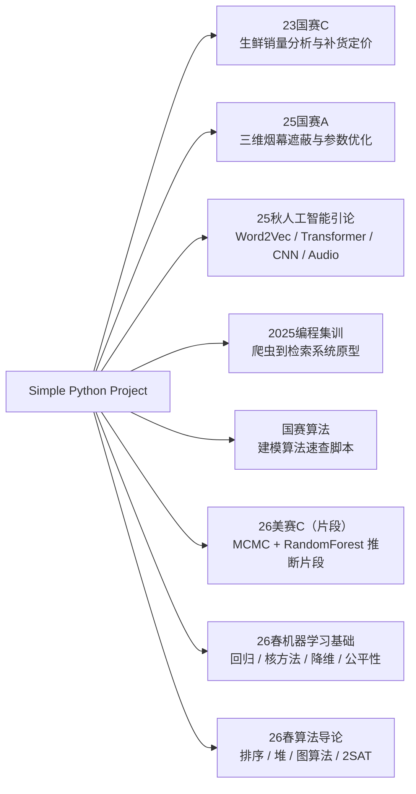

# Simple Python Project

这个仓库是我的 Python 学习、课程实验、数学建模竞赛和算法练习档案。它不是一个单一产品工程，而是一组按场景沉淀下来的代码材料：有完整一点的课程实验，有竞赛建模脚本，有从爬虫到检索页面的原型，也有为了掌握某个算法而写的短脚本。

我希望前辈阅读这个仓库时，能够快速判断三件事：

- 我做过哪些类型的问题，以及每类问题中承担了什么实现工作。
- 代码背后的建模或工程路线是什么，哪些地方是核心逻辑。
- 当前材料的成熟度和局限在哪里，哪些脚本可以复现，哪些只是阶段性草稿。

## 仓库地图



| 目录 | 主要内容 | 成熟度 | 阅读入口 |
| --- | --- | --- | --- |
| `23国赛C/` | 2023 国赛 C 题：蔬菜销售规律、品类需求、补货量、定价和单品选择。 | 按题目拆分的竞赛脚本，依赖原题附件和本机路径。 | `23国赛C/README.md` |
| `25国赛A/` | 2025 国赛 A 题：导弹、无人机、烟幕云团和真实目标的三维几何遮蔽计算及优化。 | 核心算法较集中，保留多版优化/验证脚本。 | `25国赛A/README.md` |
| `25秋人工智能引论/` | AI 课程实验：Word2Vec、Transformer 英中翻译、CIFAR-10、音频处理、早期算法实验。 | 课程实验集合，部分子项目可独立运行。 | `25秋人工智能引论/README.md` |
| `2025编程集训/` | 暑期编程集训：网页抓取、URL 规范化、中文分词、倒排索引、BM25 和 Flask 检索页面。 | 从课堂练习演进到小型检索系统原型。 | `2025编程集训/README.md` |
| `国赛算法/` | 数学建模常用算法短脚本：分类、聚类、预测、优化、评价、随机过程、强化学习。 | 算法速查和教学型示例，不是统一库。 | `国赛算法/README.md` |
| `26美赛C（片段）/` | 美赛 C 题阶段性片段：MCMC 反推潜在投票份额，随机森林预测测试集。 | 片段归档，缺少完整数据和论文。 | `26美赛C（片段）/README.md` |
| `26春机器学习基础/` | 机器学习基础课程实验：线性模型、稀疏学习、核方法、PCA/RPCA、压缩感知、流形学习、点集配准、公平性。 | 课程实验集合，带大量结果图。 | `26春机器学习基础/README.md` |
| `26春算法导论/` | 算法导论课程作业：归并排序、逆序对、Miller-Rabin、优先队列、选择算法、斐波那契堆、Huffman、SCC、Johnson、2SAT。 | 作业脚本集合，可单独运行。 | `26春算法导论/README.md` |

## 技术覆盖

| 方向 | 工具与方法 |
| --- | --- |
| 数据处理 | `pandas`、`numpy`、Excel/CSV 读取、时间字段处理、聚合透视表 |
| 可视化 | `matplotlib`、`seaborn`、热力图、散点图、训练曲线、结果图 |
| 机器学习 | `scikit-learn`、KNN、SVM、决策树、随机森林、逻辑回归、K-Means、层次聚类 |
| 数值优化 | `scipy.optimize`、粒子群、遗传算法、模拟退火、启发式筛选、MCMC |
| 深度学习 | `PyTorch`、Transformer、Word2Vec、CNN、VGG/ResNet 风格网络 |
| 信息检索 | `requests`、`BeautifulSoup`、`jieba`、URL 规范化、倒排索引、BM25、Flask |
| 理论算法 | 分治、堆、随机化、图最短路、强连通分量、2SAT、Huffman 编码 |

## 如何阅读

如果关注建模能力，建议先看 `25国赛A/`。这个目录最能体现“把题意翻译成几何判定，再用数值搜索找方案”的过程。

如果关注数据分析和经营决策建模，可以看 `23国赛C/`。它覆盖从销售规律解释到补货定价优化的一条完整链路，但代码仍保留绝对路径，需要先改路径才能复现。

如果关注 AI 基础实现，可以看 `25秋人工智能引论/`。其中 `lab6_w2v` 手写 Word2Vec 的损失和梯度，`lab7` 手写 Transformer 结构，`lab8` 实现轻量 CNN 分类器。

如果关注工程化意识，可以看 `2025编程集训/`。它展示了从单日脚本到模块化爬虫、预处理、索引、检索和 Web 页面的一次小型演进。

如果关注机器学习数学基础和手写实验，可以看 `26春机器学习基础/`；如果关注经典算法实现和复杂度训练，可以看 `26春算法导论/`。

## 复现说明

这个仓库中有三类代码，复现难度不同：

| 类型 | 说明 |
| --- | --- |
| 可直接运行的教学脚本 | `国赛算法/` 中大部分脚本使用模拟数据或内置数据集，安装依赖后可直接运行。 |
| 依赖本地数据的竞赛脚本 | `23国赛C/`、`26美赛C（片段）/` 需要原题附件，并且部分脚本保留了 `C:\Users\...` 形式的本机路径。 |
| 课程实验项目 | `25秋人工智能引论/` 中部分实验带数据和权重，部分实验需要按子目录说明准备环境。 |
| 课程作业集合 | `26春机器学习基础/` 和 `26春算法导论/` 多数脚本可单独运行，但部分实验依赖同目录数据文件或会输出图像。 |

常用依赖可以先按需安装：

```bash
pip install numpy pandas matplotlib seaborn scikit-learn scipy openpyxl
pip install torch torchvision jieba flask requests beautifulsoup4 url-normalize
```

深度学习实验建议单独建立环境，避免 PyTorch、CUDA、Jupyter 和旧版依赖之间互相影响。

## 当前局限

- 这个仓库保留了学习和竞赛推进痕迹，部分脚本命名和版本管理还不够工程化。
- 若干脚本依赖本机绝对路径，直接运行前需要改数据路径。
- 一些竞赛代码是多轮调参和交叉验证留下的版本，README 会标明哪些文件是核心、哪些是验证或空占位。
- 大部分脚本没有单元测试，验证方式主要是运行输出、图像结果和人工复核。

后续整理重点是：把竞赛脚本中的路径参数化，补充关键结果文件，减少空文件和重复版本，并把最能代表能力的项目进一步整理成可复现实验。
