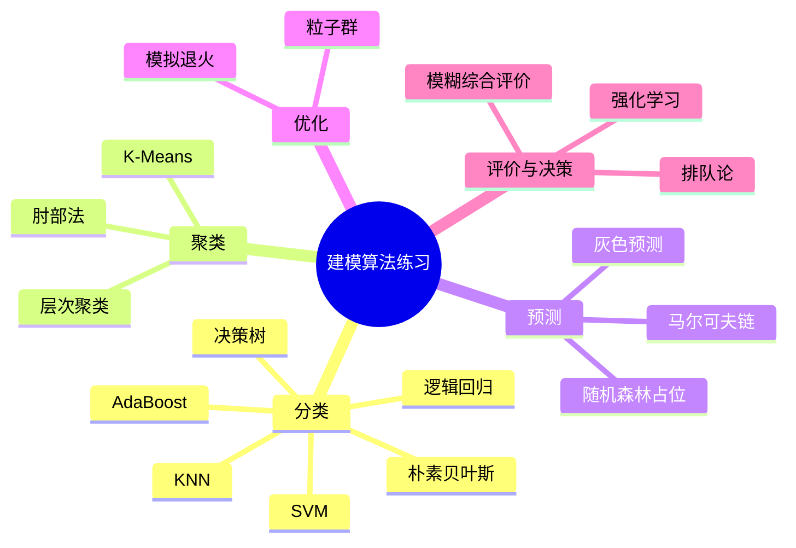

# 数学建模与机器学习算法练习

本目录是一个数学建模竞赛算法速查本。每个脚本围绕一个典型方法展开，通常采用“模拟数据或内置数据 -> 建模 -> 计算 -> 评价/可视化”的结构。

这些脚本的定位不是封装成库，而是在竞赛前快速掌握常见模型的输入输出、核心假设、适用场景和代码写法。阅读时更应该关注算法思想和可迁移结构，而不是把它们当作生产级实现。

## 算法地图



## 分类与监督学习

| 文件 | 方法 | 说明 |
| --- | --- | --- |
| `K近邻（KNN）-花分类.py` | KNN | 手写 KNN 分类器，包含 Min-Max 归一化、距离计算、加权投票和交叉验证选 K。 |
| `朴素贝叶斯-垃圾文件判断.py` | 朴素贝叶斯 | 用关键词集合构建词表，计算先验概率和带拉普拉斯平滑的似然概率。 |
| `决策树-员工离职预测.py` | 决策树 | 构造员工离职模拟数据，训练 CART 决策树，输出准确率、特征重要性和树结构图。 |
| `SVM支持向量机-红酒分类.py` | SVM | 模拟红/白葡萄酒数据，比较线性核和 RBF 核，并绘制决策边界。 |
| `二分类-信用卡欺诈.py` | 逻辑回归 | 构造欺诈交易模拟数据，使用标准化、类别权重、ROC/PR 曲线和决策边界。 |
| `自适应-信用卡.py` | AdaBoost | 手写 AdaBoost 框架，用弱决策树和样本权重迭代训练二分类模型。 |

## 聚类分析

| 文件 | 方法 | 说明 |
| --- | --- | --- |
| `K-均值聚类-顾客分类.py` | K-Means | 构造 RFM 顾客数据，归一化后聚类，并用 3D 图和轮廓系数评价。 |
| `K-均值聚类（肘部法确定K）-花.py` | 肘部法 | 在 Iris 数据集上计算不同 K 的 SSE，演示如何选择聚类数。 |
| `层次聚类-肿瘤分类.py` | 层次聚类 | 模拟基因表达数据，绘制 dendrogram，并用肘部法和轮廓系数辅助判断簇数。 |

## 预测、随机过程与评价

| 文件 | 方法 | 说明 |
| --- | --- | --- |
| `灰色预测-企业能耗.py` | GM(1,1) | 实现累加生成、紧邻均值、最小二乘求参、残差修正和后验差检验。 |
| `马尔可夫链-股票预测.py` | 马尔可夫链 | 模拟股票涨跌平状态，估计转移矩阵并计算平稳分布。 |
| `模糊评价-供应商选择.py` | 模糊综合评价 | 定义因素集、评语集、权重和隶属度矩阵，对供应商进行综合评价。 |
| `排队论-柜台.py` | M/M/1 排队 | 模拟顾客到达和服务过程，计算等待时间、系统逗留时间和队列长度。 |
| `随机森林-日用品周销量.py` | 随机森林 | 当前是空文件，还没有有效实现。 |

## 优化与强化学习

| 文件 | 方法 | 说明 |
| --- | --- | --- |
| `退火算法-二维函数最小化（多峰优化）.py` | 模拟退火 | 在二维 Rastrigin 函数上演示非凸优化搜索。 |
| `粒子群-最优线性参数选择.py` | PSO | 用粒子群搜索线性模型的斜率和截距，并绘制收敛曲线与拟合曲线。 |
| `强化学习-网格迷宫.py` | Q-learning | 定义网格环境、动作、奖励和 Q 表，训练后输出最优路径。 |

## 运行说明

大多数脚本使用模拟数据或 `scikit-learn` 内置数据集，可单独运行：

```bash
python K近邻（KNN）-花分类.py
```

常用依赖：

```bash
pip install numpy pandas matplotlib scikit-learn scipy seaborn
```

部分脚本会弹出图像窗口，适合在本地 Python 环境或支持图形显示的 IDE 中运行。

## 阅读建议

建议按问题类型阅读，而不是按文件名顺序阅读：

- 需要分类：先看 KNN、逻辑回归、决策树、SVM。
- 需要无监督分群：看 K-Means 和层次聚类。
- 需要小样本趋势预测：看灰色预测。
- 需要多指标综合打分：看模糊评价。
- 需要搜索连续参数：看模拟退火和粒子群。
- 需要状态转移或策略学习：看马尔可夫链和 Q-learning。

## 局限

- 多数数据是模拟构造，结论不代表真实业务数据。
- 脚本之间没有统一 API，也没有测试框架。
- 参数设置偏教学演示，正式建模时需要重新做数据检验、特征工程和模型验证。
- 有一个空占位文件 `随机森林-日用品周销量.py`，后续需要补全或删除。

这个目录的价值在于“快速迁移”：在比赛中遇到一个问题时，可以迅速找到相似方法的最小代码骨架，再按题目数据和约束改写。
